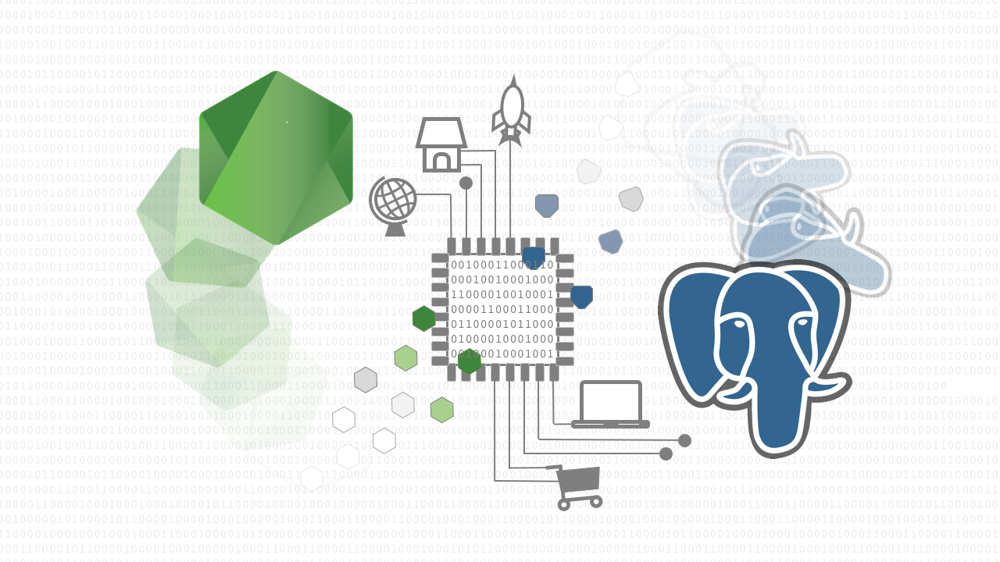

# Node, SQL, PostgreSQL - Mastering Backend Web Development

"Node, SQL, PostgreSQL - Mastering Backend Web Development": Official guide repo used to accompany video lessons.

## Take the course here
[https://www.udemy.com/node-postgresql](https://www.udemy.com/node-postgresql)

### What you'll learn:
* Build full Node and PostgreSQL applications.
* Apply various web requests to their custom backend applications.
* Use advanced es6 concepts to write more concise code.
* Have an understanding of the Node event loop.
* Discuss the backend Web Development with fellow software engineers.
* Use and build Node middleware, for error handling as well as parsing incoming data.
* Extend Node applications with third-party libraries.

This provides the completed projects for:
* first_server
* fortunes_api
* "psql_section"
* monsters_api
